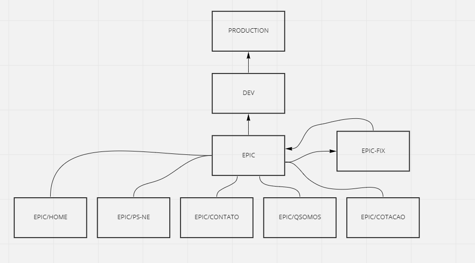

# LaBellezaDellaDuchessa

<h1>GITHUB</H1>

Neste projeto utilizamos as tecnologias HTML5, CSS e Javascript para desenvolver um site com 7 páginas web, para promover um salão de beleza. Sendo assim, o projeto foi dividido em 5 partes, cada um do grupo ficando responsável por uma parte e no fim sendo unido todo o código. Utilizamos o seguinte fluxograma para demonstrar nossa arquitetura do github. Começando pela parte de baixo, temos as 5 branchs responsáveis por armazenar o código de cada membro do time, tais branchs são ligadas diretamente com a branch "mãe" nomeada EPIC, Após o término individual de cada membro, o código é unido por meio de merge das branchs "filhas"(EPIC-HOME,EPIC-PS,EPIC/CONTATO,EPIC-QSOMOS e EPIC-COTACAO) com a branch "mãe"(EPIC) utilizando PRs.

### Explicação:

Este método foi adotado para que não houvesse muitos conflitos de códigos ou arquivos iguais, a utilizacao de apenas uma branch iria tornar o merge do código desnecessariamente trabalhoso e suscetível a bugs.

Após o merge de todas as branchs "filhas" na branch "mãe" é realizado um teste com todo o site unido. Devido a ocasionais problemas no projeto, foi criado uma branch nomeada de "EPIC-FIX", onde  o código unido foi enviado para realizarmos a correção de bugs e problemas de cada página.

A criação da branch "EPIC-FIX" foi necessária para que fosse controlado a versão dos nossos códigos, evitando assim, a perda de algum código ou funcionalidades do projeto.

Após a conferência dos códigos é  feito o merge da branch "EPIC-FIX" para branch "EPIC", e por fim, solicitando PR para merge da branch "EPIC" para branch "DEV", onde é armazenado o código pronto.

A  branch Production é onde será colocado para distriuição ao usuário (colocado o site online pela aba pages do github).

<h1>Site em geral</h1>
<h3>Projeto em Grupo(Primeiro módulo do curso da Resília/Senac)</h3>

Nesse primeiro módulo fomos desafiados a criar um site de uma mini empresa de bairro que está começando a expandir o seu negócio.
 

Nossa equipe é formada por 5 integrantes: Daniella, Diego, Indiane, Paloma e Rian. A organização das tarefas de cada integrante foi designada com intuito de todos conseguirem participar de forma equilibrada. A escolha do tema foi realizada por meio de sorteio para que fosse justo. O tema do salão de beleza se tornou um desafio para equipe pois não existem muitos sites online com a proposta que decidimos oferecer, após muito trabalho e dedicação de todos nasceu o La Bellezza Della Duchessa.

<h3>Proposta</h3>

La Bellezza Della Duchessa traz ao público uma inovação na área da beleza, além de encantar com produtos 100% naturais.

<h3>Estrutura Page</h3>

A pagina foi dividida em 6 partes(Inicio, quem somos,nossa equipe,nossos produtos e serviços,cotação e fale conosco)

<h4>Inicio</h4>

Apresentação da empresa e comentários

<h4>Quem Somos</h4>

História da empresa

<h4>Nossa Equipe</h4>

Os responsaveis pela criação da page

<h4>Nossos produtos e serviços</h4>

Serviços que prestamos

<h4>Cotação</h4>

Tela de cotação de valores e descrição dos produtos

<h4>Fale conosco</h4>

Formulário de contato, tanto para clientes , como para fornecedores

